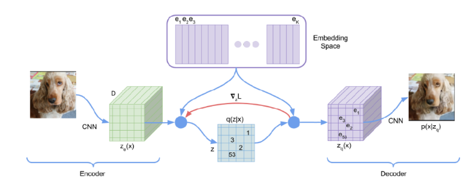
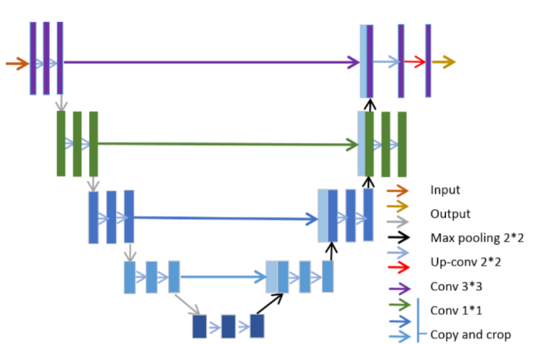
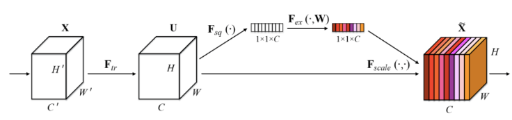
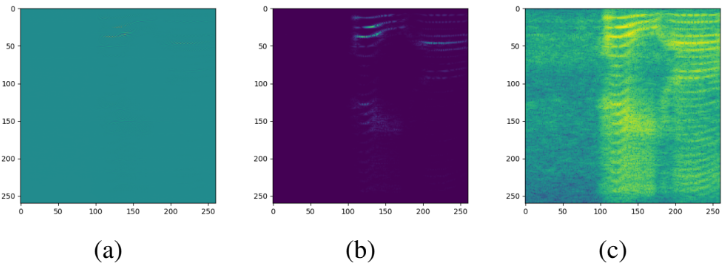
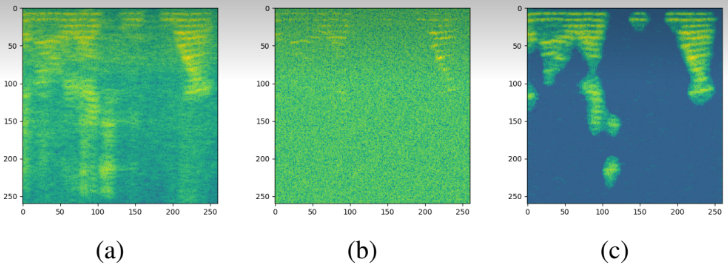
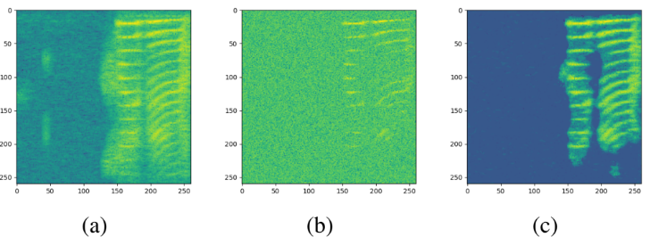

# Vector-Quantized-Variational-Autoencoder-para-Audio-Denoising-com-U-Net-e-SE-blocks
Propomos um modelo inovador de audio denoising utilizando um híbrido de Vector Quantized Variational Autoencoder (VQVAE) e U-Net combinado com a  Transformada de Fourier de Tempo Curto (STFT) para processamento de espectrogramas limpos e ruidosos.
A arquitetura do modelo VQVAE-UNet combina técnicas de quantização vetorial e redes neurais convolucionais para alcançar uma representação discreta e detalhada dos dados de entrada. A estrutura base é fundamentada na arquitetura da U-Net, mas incluindo um bloco de Squeeze-and-Excitation em cada um dos seus estágios e um quantizador vetorial em seu bottleneck.

*Vector Quantized Variational Autoencoder*

A abordagem da U-Net se justifica pela sua grande capacidade de realizar reconstruções complexas, sendo originalmente desenvolvida para segmentação de imagens médicas. Já os SE-blocks foram escolhidos para realçar a representatividade dos feature maps ao recalibrar dinamicamente os canais, numa forma de channel-wise self-attention, amplificando consideravelmente a capacidade do modelo a um custo computacional extra praticamente desprezível.

*UNet Architecture*

*Squeeze-and-Excitation Block*

O modelo implementado se distingue da U-Net convencional ao passar o espaço latente, ou seja, a saída do último layer do encoder, para um quantizador vetorial, onde ele é codificado com o codebook e discretizado, gerando como output os vetores discretos representantes e a quantization loss, exatamente como nos VQ-VAEs. Essas representações discretas, juntamente com as saídas intermediárias dos layers correspondentes do encoder, são passadas para o decoder, onde o espectrograma é limpo e progressivamente reconstruído.

A STFT (Short-Time Fourier Transform) é uma técnica para transformar um sinal de áudio em uma representação de frequência-tempo. Isso é feito aplicando a Transformada de Fourier a janelas sobrepostas do sinal de áudio. Para este projeto, utilizamos a função STFT do SciPy, configurada com os seguintes parâmetros:

Frequência de amostragem (fs): 8000 Hz
Número de pontos por segmento (nperseg): 519
Número de pontos de sobreposição (noverlap): 488
Esses parâmetros foram escolhidos para garantir que os espectrogramas resultantes sejam quadrados, o que é ideal para as operações de convolução realizadas pela arquitetura U-Net.

Para treinar o modelo de denoising, adicionamos ruído gaussiano aos espectrogramas de entrada. Isso simula as condições de ruído de fundo que o modelo deve aprender a remover. A intensidade do ruído pode ser ajustada conforme necessário para equilibrar a dificuldade da tarefa de denoising.

O processo de treinamento é iterativo, com o modelo alternando entre fases de treinamento e validação:

O modelo recebe espectrogramas ruidosos.
Os espectrogramas ruidosos são passados pelo VQ-VAE (Vector Quantized Variational Autoencoder).
A perda de reconstrução é calculada em relação aos espectrogramas originais (sem ruído). A perda total inclui a perda de quantização, que força os códigos latentes a permanecerem próximos dos centros de quantização.
O otimizador AdamW atualiza os pesos do modelo com base no gradiente da perda total.

O modelo é avaliado em um conjunto de dados de teste.
Esta fase ajuda a monitorar o desempenho do modelo e ajustar a taxa de aprendizado através do scheduler.
Cálculo e Monitoramento das Perdas
A perda total é calculada como a soma ponderada da MSELoss, L1Loss e perda de quantização. Durante cada época, monitoramos a perda média de treinamento e validação para avaliar a performance do modelo e ajustar hiperparâmetros conforme necessário.

A ISTFT é o processo inverso da STFT. Utilizamos a função ISTFT do SciPy para converter os espectrogramas reconstruídos de volta ao domínio do tempo. Este passo é essencial para avaliar a qualidade do denoising no contexto do sinal de áudio original.

Os espectrogramas representam a densidade espectral do sinal de áudio ao longo do tempo. No entanto, as magnitudes das frequências podem variar em várias ordens de magnitude, o que dificulta a visualização e a interpretação das informações contidas nos espectrogramas. Para mitigar esse problema, aplicamos a transformação logarítmica na magnitude dos espectrogramas.

*Espectrograma original (a), espectrograma em magnitude (b), espectrograma em log-magnitude (c).*

Como pode ser observado nos dois exemplos das figuras abaixo, o modelo proposto apresenta uma capacidade de denoising considerável, eliminando o ruído quase que em sua totalidade, e, surpreendentemente, não apenas o ruído gaussiano artificialmente adicionado, como também o ruído natural dos espectrogramas antes do pré-processamento, ou seja, teoricamente limpos. Naturalmente, questões sobre eventuais perdas de informação resultantes de um denoising evidentemente tão agressivo foram levantadas, e, diante disso, analisaremos métricas objetivas de avaliação tanto de presença de ruído quanto de qualidade e inteligibilidade sonora, de fato.

Exemplo 1:

*Comparação entre os espectrogramas limpo (a), com ruído (b) e reconstruído sem ruído (c).*

Exemplo 2:

O desempenho do modelo foi avaliado por meio das seguintes métricas objetivas:

STOI (Short-Time Objective Intelligibility): Avalia a inteligibilidade da fala aprimorada.
PESQ (Perceptual Evaluation of Speech Quality): Avalia a qualidade perceptual da fala aprimorada.
NSR (Noise-to-Signal Ratio): Mede a relação entre a potência do ruído e a potência do sinal de voz.

Comparando a qualidade, a inteligibilidade e a presença de ruído entre os áudios ruidosos e reconstruídos (denoised) tendo os áudios originais como referência, as métricas objetivas mostraram avanços nas três categorias, com diferenças consideráveis. Para fins de comparação, o STOI varia numa range de 0 a 1, sendo 0 completamente ininteligível e 1 perfeitamente inteligível. Tendo como padrão os áudios originais, os respectivos áudios ruidosos são significativamente menos compreensíveis, com STOI de 0.248, situação que muda com o processo de denoising, que aumenta o STOI para 0.852, consideravelmente elevando a inteligibilidade, embora ainda haja uma diferença em relação ao áudio limpo. De forma semelhante, o modelo também melhorou a qualidade perceptual do áudio em relação à sua versão ruidosa, levando o PESQ de 1.178 para 2.477. Um ponto a se considerar, no entanto, é que a range dessa métrica varia de -0.5 a 4.5, ou seja, apesar do avanço na qualidade comparado ao ruidoso, o áudio reconstruído ainda está longe do que seria considerado ótimo. Já quanto ao NSR, que mede a proporção entre ruído e sinal, uma queda de 3.52 dB para 0.052 dB representa um avanço evidente, indicando uma eliminação substancial de ruído e comprovando objetivamente a eficácia do modelo proposto.

[Audio ruidoso](audios/noisy_audio1.wav)
[Audio sem ruido](audios/denoised_audio1.wav)
[Audio ruidoso](audios/good_audio1.wav)

[Audio ruidoso](audios/noised_audio2.wav)
[Audio ruidoso](audios/denoised_audio2.wav)
[Audio ruidoso](audios/good_audio2.wav)

[Audio ruidoso](audios/noised_audio3.wav)
[Audio ruidoso](audios/denoised_audio3.wav)
[Audio ruidoso](audios/good_audio3.wav)

<audio controls>
  <source src="https://github.com//repository/raw/main/example.wav" type="audio/wav">
  Your browser does not support the audio element.
</audio>

