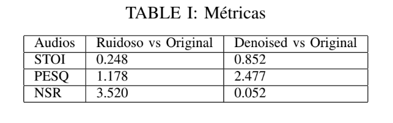

# Vector-Quantized-Variational-Autoencoder-para-Audio-Denoising-com-U-Net-e-SE-blocks
This project introduces an advanced deep learning framework for audio denoising, combining the strengths of a Vector Quantized Variational Autoencoder (VQVAE) and a U-Net architecture, augmented with Squeeze-and-Excitation (SE) blocks. The proposed model, referred to as VQVAE-UNet, leverages the Short-Time Fourier Transform (STFT) to process spectrograms, enabling effective noise reduction in audio signals. By integrating vector quantization and convolutional neural networks, the model achieves a discrete yet highly detailed representation of input data, making it particularly suitable for complex audio reconstruction tasks.

*Vector Quantized Variational Autoencoder*

The U-Net architecture, renowned for its success in medical image segmentation, serves as the backbone of this model due to its ability to perform precise and intricate reconstructions. To further enhance feature representation, SE blocks are incorporated at each stage of the U-Net. These blocks dynamically recalibrate channel-wise feature responses, effectively acting as a form of channel-wise self-attention. This enhancement significantly improves the model's representational capacity with minimal computational overhead.

*UNet Architecture*

*Squeeze-and-Excitation Block*

The VQVAE-UNet architecture distinguishes itself from the conventional U-Net by introducing a vector quantizer at the bottleneck. The latent space output from the encoder is quantized using a codebook, producing discrete representations that capture essential features of the input spectrogram. These discrete vectors, along with intermediate outputs from the encoder, are passed to the decoder, where the spectrogram is progressively reconstructed and denoised.
SE blocks are integrated into the U-Net to enhance feature maps by adaptively weighting channel-wise features. This mechanism allows the model to focus on the most informative channels, improving its ability to capture subtle patterns in the spectrograms.

The Short-Time Fourier Transform (STFT) is employed to convert audio signals into time-frequency representations (spectrograms). This transformation is critical for capturing both temporal and spectral characteristics of the audio. For this project, the STFT is implemented using the SciPy library with the following parameters:

Sampling frequency (fs): 8000 Hz
Number of points per segment (nperseg): 519
Number of overlap points (noverlap): 488

These parameters ensure that the resulting spectrograms are square-shaped, which is optimal for convolutional operations in the U-Net architecture.

To simulate real-world noise conditions, Gaussian noise is added to the input spectrograms during training. The model is trained iteratively, alternating between training and validation phases:

Input: Noisy spectrograms are fed into the VQVAE-UNet.
Reconstruction: The model processes the noisy spectrograms through the VQVAE, generating discrete latent representations.
Loss Calculation: The reconstruction loss is computed relative to the original (clean) spectrograms. The total loss includes a quantization loss, which ensures the latent codes remain close to the codebook's quantization centers.
Optimization: The AdamW optimizer updates the model weights based on the gradient of the total loss.
Validation: The model's performance is evaluated on a separate test dataset to monitor generalization and adjust hyperparameters as needed.

*Original spectogram (a), magnitude (b), log-magnitude (c).*

Exemplo 1:

*Clean spectograms (a), noisy (b) and denoised (c).*

Exemplo 2:

The model's performance is assessed using the following objective metrics:

STOI (Short-Time Objective Intelligibility): Measures speech intelligibility on a scale from 0 (completely unintelligible) to 1 (perfectly intelligible).
PESQ (Perceptual Evaluation of Speech Quality): Evaluates perceptual speech quality, ranging from -0.5 to 4.5.
NSR (Noise-to-Signal Ratio): Quantifies the ratio of noise power to signal power.

The proposed model demonstrates significant improvements in denoising performance:

STOI: Increased from 0.248 (noisy audio) to 0.852 (denoised audio), indicating a substantial enhancement in intelligibility.
PESQ: Improved from 1.178 to 2.477, reflecting better perceptual quality, though further optimization is needed to reach higher scores.
NSR: Reduced from 3.52 dB to 0.052 dB, confirming effective noise suppression.

The model's denoising capability is visually evident in the spectrograms, where noise is nearly eliminated without significant loss of signal integrity. Auditory analysis further supports these findings, with denoised audio exhibiting improved clarity and reduced background noise.

**Samples**

1: [Noisy audio](audios/noisy_audio1.wav)
[Reconstructed audio](audios/denoised_audio1.wav)

2: [Noisy audio](audios/noised_audio2.wav)
[Reconstructed audio](audios/denoised_audio2.wav)

3: [Noisy audio](audios/noised_audio3.wav)
[Reconstructed audio](audios/denoised_audio3.wav)

